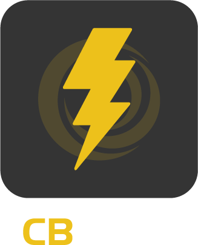

# Introduction

<figure><figcaption></figcaption></figure>

CBWIRE revolutionizes BoxLang and CFML web development by bringing reactive UI capabilities directly to your server-side code. Build dynamic, interactive interfaces without writing JavaScript, managing APIs, or dealing with complex frontend frameworks.

## CFSummit 2025 2-Day Workshop

[Register](https://www.eventbrite.com/e/workshop-building-reactive-uis-with-cbwire-tickets-1426617624719?aff=oddtdtcreator) for our upcoming 2-day CBWIRE workshop at CFSummit!

## Your First Component

Let's create a reactive counter component to demonstrate CBWIRE's power. Download and install [CommandBox](https://www.ortussolutions.com/products/commandbox), then run these commands:

```bash
mkdir cbwire-playground --cd
install cbwire@4
install commandbox-boxlang
coldbox create app
server start cfengine=boxlang javaVersion=openjdk21_jdk
```

### 1. Add Component to Layout

Insert a counter component into your Main layout using `wire("Counter")`:



```html
<!-- layouts/Main.bxm -->
<bx:output>
<!doctype html>
<html>
    <head>
        <title>CBWIRE Demo</title>
    </head>
    <body>
        <!-- Insert our reactive counter -->
        #wire("Counter")#
    </body>
</html>
</bx:output>
```



```html
<!-- layouts/Main.cfm -->
<cfoutput>
<!doctype html>
<html>
    <head>
        <title>CBWIRE Demo</title>
    </head>
    <body>
        <!-- Insert our reactive counter -->
        #wire("Counter")#
    </body>
</html>
</cfoutput>
```



### 2. Create the Component

Define your Counter [component](the-essentials/components.md):



```javascript
// wires/Counter.bx
class extends="cbwire.models.Component" {
    
    data = {
        "counter": 0
    };

    function increment() {
        data.counter++;
    }
    
    function decrement() {
        data.counter--;
    }
}
```



```javascript
// wires/Counter.cfc
component extends="cbwire.models.Component" {
    
    data = {
        "counter" = 0
    };

    function increment() {
        data.counter++;
    }
    
    function decrement() {
        data.counter--;
    }
}
```



### 3. Create the Template

Define the counter [template](the-essentials/templates.md):



```html
<!-- wires/counter.bxm -->
<bx:output>
<div>
    <h1>Count: #counter#</h1>
    <button wire:click="increment">+</button>
    <button wire:click="decrement">-</button>
</div>
</bx:output>
```



```html
<!-- wires/counter.cfm -->
<cfoutput>
<div>
    <h1>Count: #counter#</h1>
    <button wire:click="increment">+</button>
    <button wire:click="decrement">-</button>
</div>
</cfoutput>
```



### 4. See the Magic

Navigate to your application in the browser. Click the + and - buttons to see the counter update instantly without page refreshes or JavaScript code! 🤯


## How Does It Work?

CBWIRE seamlessly bridges your server-side BoxLang or CFML code with dynamic frontend behavior:

1. **Initial Render**: CBWIRE renders your component with its default data values
2. **User Interaction**: When a user clicks a button with `wire:click`, Livewire.js captures the event
3. **Server Request**: The interaction triggers an AJAX request to your CBWIRE component's action method
4. **Data Processing**: Your server-side action method processes the request and updates component data
5. **Response & Update**: The updated HTML is sent back and Livewire.js efficiently updates only the changed parts of the DOM

This approach gives you the responsiveness of modern JavaScript frameworks while keeping your logic in familiar server-side code.

## Why CBWIRE?

Building our reactive counter with CBWIRE meant we:

* ✅ **Developed a responsive interface** without writing JavaScript
* ✅ **Avoided creating backend APIs** - everything stays in your ColdBox application
* ✅ **Eliminated page refreshes** while maintaining server-side control
* ✅ **Skipped complex build processes** like webpack or JavaScript compilation
* ✅ **Stayed in our BoxLang/CFML environment** using familiar syntax and patterns

## Better With Alpine.js

While CBWIRE handles server communication beautifully, sometimes you need instant client-side updates without server round-trips. This is where [Alpine.js](https://alpinejs.dev/) shines - a lightweight JavaScript framework designed to work perfectly with Livewire (and therefore CBWIRE).

Let's enhance our counter to use Alpine.js for instant updates and add persistence:



```javascript
// wires/Counter.bx
class extends="cbwire.models.Component" {   
    
    data = {
        "counter": 0
    };

    function onMount() {
        variables.data.counter = session.counter ?: 0;
    }
    
    function save(counter) {
        session.counter = arguments.counter;
    }
}
```



```javascript
// wires/Counter.cfc
component extends="cbwire.models.Component" {   
    
    data = {
        "counter" = 0
    };

    function onMount() {
        variables.data.counter = session.counter ?: 0;
    }
    
    function save(counter) {
        session.counter = arguments.counter;
    }
}
```





```html
<!-- wires/counter.bxm -->
<bx:output>
<div 
    x-data="{
        counter: $wire.counter,
        increment() { this.counter++; },
        decrement() { this.counter--; },
        async save() {
            await $wire.save(this.counter);
        }
    }"
    wire:ignore.self>
    
    <h2>Counter: <span x-text="counter"></span></h2>
    <button @click="increment">+</button>
    <button @click="decrement">-</button>
    <button @click="save">Save</button>
</div>
</bx:output>
```



```html
<!-- wires/counter.cfm -->
<cfoutput>
<div 
    x-data="{
        counter: $wire.counter,
        increment() { this.counter++; },
        decrement() { this.counter--; },
        async save() {
            await $wire.save(this.counter);
        }
    }"
    wire:ignore.self>
    
    <h2>Counter: <span x-text="counter"></span></h2>
    <button @click="increment">+</button>
    <button @click="decrement">-</button>
    <button @click="save">Save</button>
</div>
</cfoutput>
```



Now the counter updates instantly on the client side, but only makes server requests when "Save" is clicked to persist the value. The `onMount()` method loads the saved counter from the session on page load. Using `$wire`, Alpine.js communicates seamlessly with your CBWIRE component.

This combination gives you complete control: instant UI feedback when needed, and server communication when you want to persist data or run complex business logic.

## What's Next?

Ready to dive deeper? Explore these essential concepts:

* [**Getting Started**](getting-started.md): Complete installation and setup guide
* [**Components**](the-essentials/components.md): Learn how to build and organize CBWIRE components
* [**Templates**](the-essentials/templates.md): Master template syntax and data binding
* [**Actions**](the-essentials/actions.md): Handle user interactions and component methods
* [**Properties**](the-essentials/properties.md): Understand data binding and reactivity
* [**Events**](the-essentials/events.md): Communicate between components and handle lifecycle events

## Credits

CBWIRE leverages the incredible JavaScript libraries [Livewire](https://laravel-livewire.com/) and [Alpine.js](https://alpinejs.dev/) for DOM diffing and client-side functionality. CBWIRE wouldn't exist without the brilliant work of [Caleb Porzio](https://x.com/calebporzio), creator of both Livewire and Alpine.js. CBWIRE brings these powerful tools into the ColdBox and BoxLang/CFML ecosystem.

The CBWIRE module is developed and maintained by [Grant Copley](https://twitter.com/grantcopley), [Luis Majano](https://twitter.com/lmajano), and the team at [Ortus Solutions](https://www.ortussolutions.com/).

## Project Support

Please consider becoming one of our [Patreon supporters](https://www.patreon.com/ortussolutions) to help us continue developing and improving CBWIRE.
